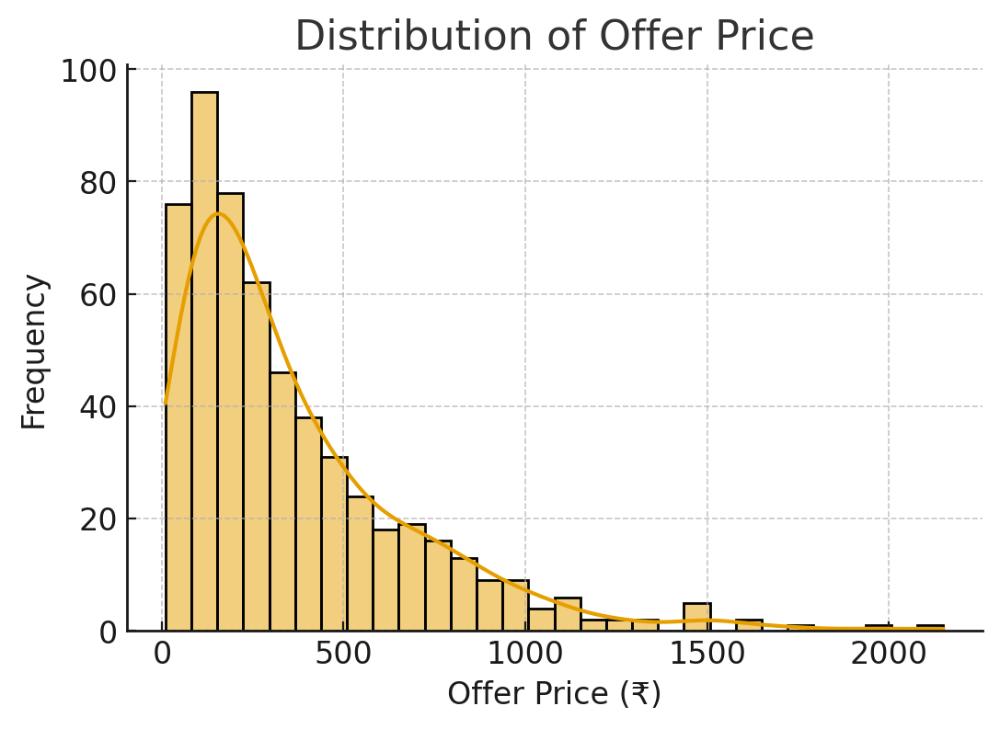
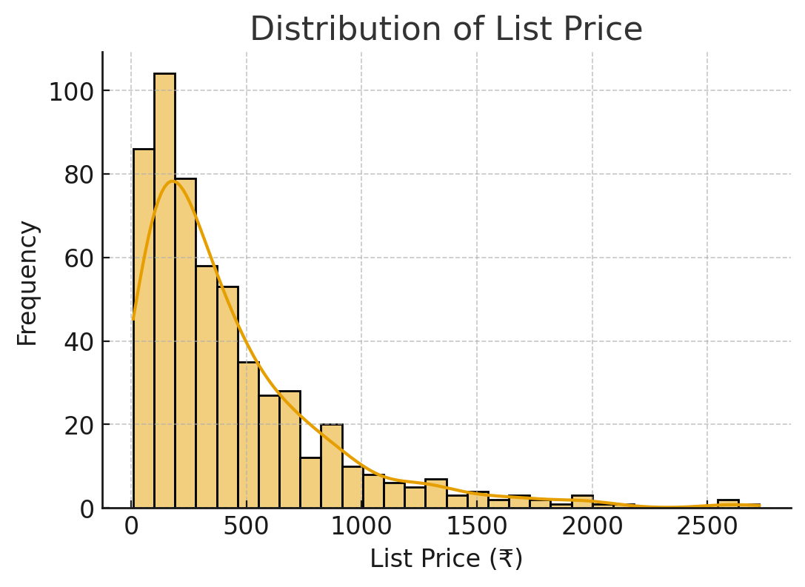
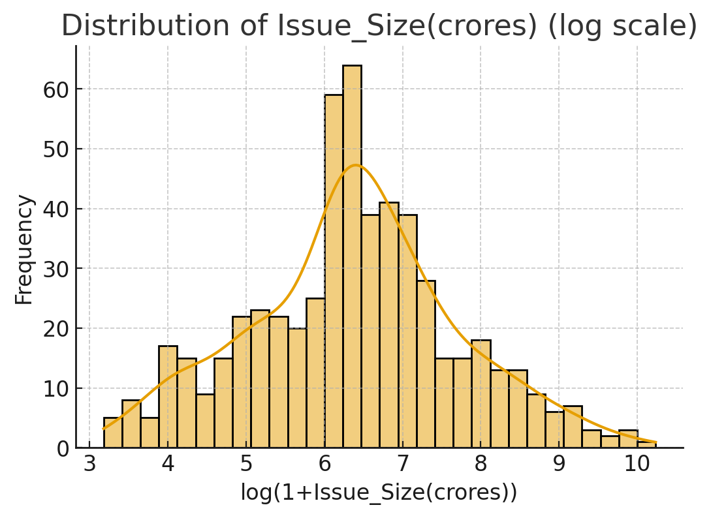
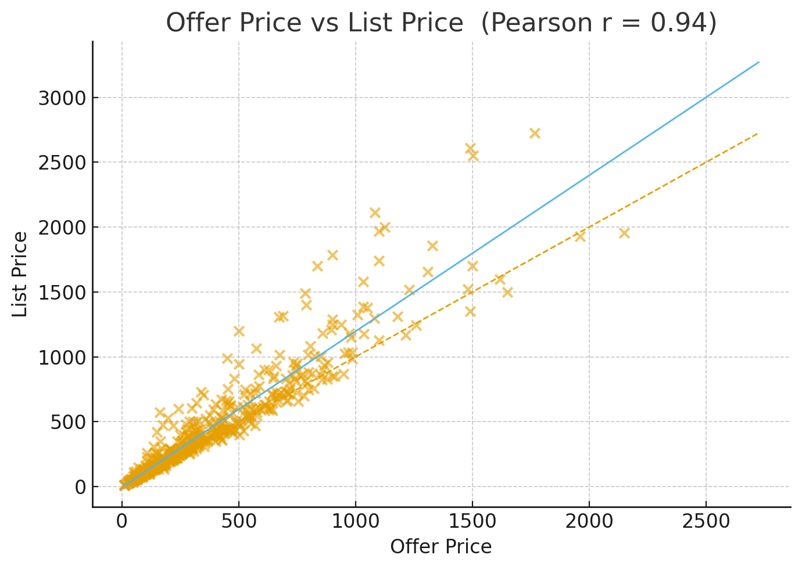
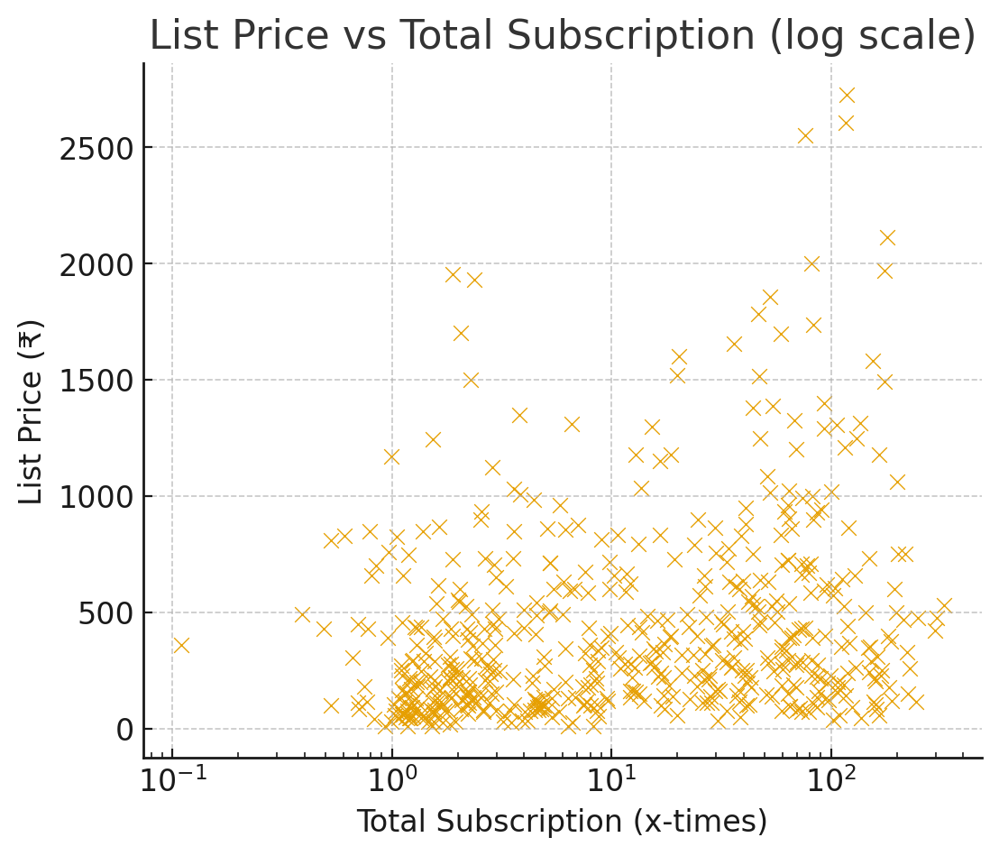
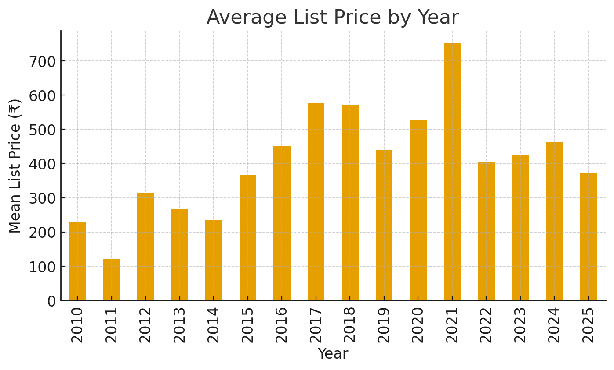

# Data-Mining-Assignment-1

Chatgpt chat link : https://chatgpt.com/share/68c752f8-35bc-8004-bf1d-adb67733cc34 \
Medium blog link : https://medium.com/@yashkalathiya164/predicting-ipo-listing-prices-with-machine-learning-a-crisp-dm-walkthrough-244d823c574c

A comprehensive data science project analyzing the factors influencing IPO listing prices, exploring demand trends, and building ML models to predict listing price.

---

## 📊 Visual Insights

### Distribution of Offer Price


### Distribution of List Price


### Distribution of Issue Size (Log Scale)


### Offer Price vs List Price (Correlation)


### List Price vs Total Subscription (Log Scale)


### Average List Price by Year


---

## 🗂 Dataset Overview

| Feature | Description |
|--------|-------------|
| **Offer Price** | IPO issue price offered to investors |
| **List Price** | Actual price on the first trading day (Target) |
| **QIB, HNI, RII** | Category-wise demand multipliers |
| **Total** | Overall subscription demand |
| **Issue Size (crores)** | Total amount of issue |

---

## 🧠 Approach & Techniques

### 1. Business Understanding

Predict **List Price** before IPO listing to guide investment decisions.  
Helps investors spot potentially underpriced or overvalued IPOs.

### 2. Data Preparation

- Dropped columns causing **data leakage** (Listing Gain %, CMP values).
- Applied `log1p()` transformation to **Total Subscription** to normalize skewed demand data.
- Handled missing values and ensured numeric types were correct.

### 3. Feature Engineering

- **Log-Transformed Total Subscription** → stabilizes variance.
- **Investor Mix Ratios** (QIB:HNI:RII) → captures relative demand pressure.

### 4. Model Selection

- **XGBoost Regressor** chosen for:
  - Handling nonlinear relationships.
  - Built-in regularization (`lambda`, `alpha`) preventing overfitting.
  - Easy interpretability with feature importance.

```python
from xgboost import XGBRegressor

model = XGBRegressor(
    n_estimators=300,
    learning_rate=0.05,
    max_depth=4,
    random_state=42
)
model.fit(X_train, y_train)
y_pred = model.predict(X_test)
```

### 5. Evaluation

- Metrics: **R² Score** and **MAE**
- Visual validation with **Predicted vs Actual** scatter plot.

---

## 📈 Why These Features?

- **Offer Price**: Baseline valuation set by issuer.
- **Total Subscription**: Strong proxy for demand.
- **Category-wise Demand**: Signals investor confidence.
- **Issue Size**: Large issues may face supply pressure.

---

## 🏗 Project Structure

```
├── data/
│   ├── raw/
│   ├── processed/
├── notebooks/
│   └── exploratory_analysis.ipynb
├── src/
│   ├── data_preprocessing.py
│   ├── feature_engineering.py
│   ├── model_training.py
│   └── evaluation.py
├── reports/
│   ├── figures/
│   │   ├── offer_vs_list_price.png
│   │   ├── effect_total_subscription.png
│   │   ├── avg_list_price_by_year.png
│   │   └── predicted_vs_actual.png
│   └── summary.md
└── README.md
```

---

## ▶️ How to Run

```bash
git clone https://github.com/yash-kalathiya/ipo-prediction.git
cd ipo-prediction

pip install -r requirements.txt

python src/data_preprocessing.py
python src/model_training.py
```

---

## 🚀 Future Improvements

- Add market sentiment indices (Nifty/BSE performance around listing date).
- Build a Streamlit dashboard for interactive exploration.
- Deploy as REST API for real-time predictions.

